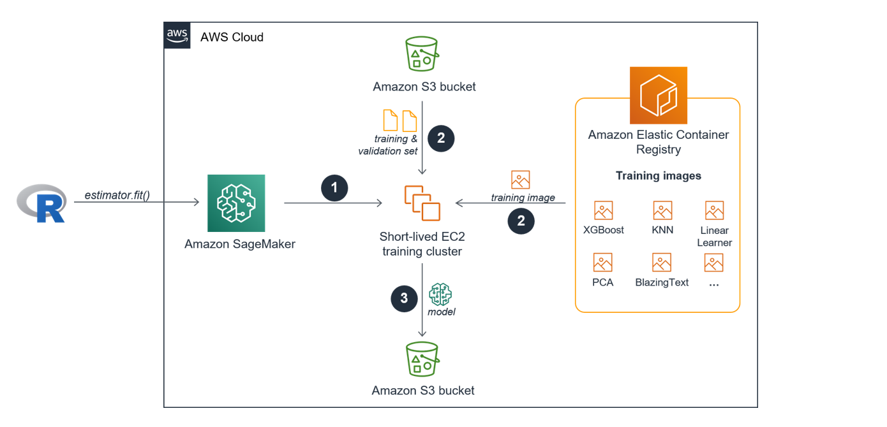
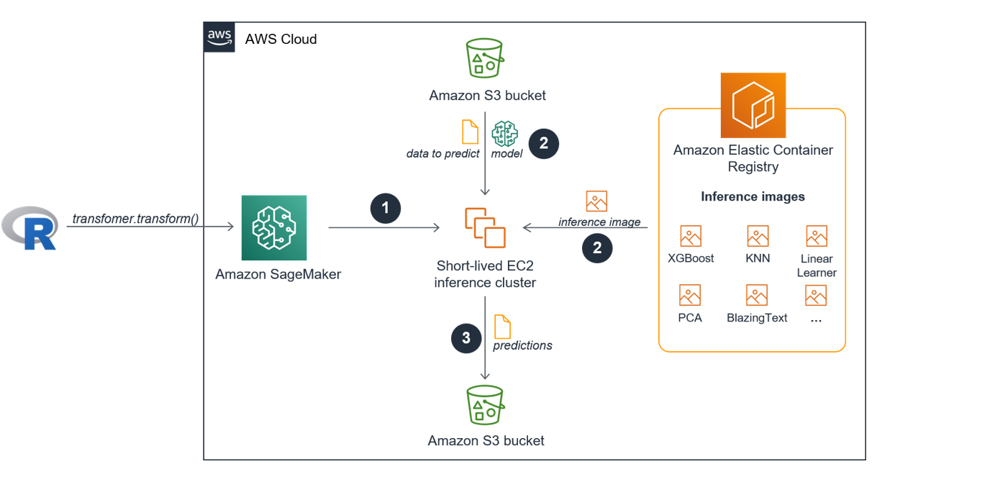

In this workshop module you will learn how to start a SageMaker training job using the built-in XGBoost algorithm to solve a binary classification problem and how to start a batch inference job to evaluate the final model performance. Along the way we have a closer look at the underlying mechanisms of SageMaker training jobs and SageMaker batch inference jobs.  

To connect to SageMaker from RStudio we will use the conda environment we created in the previous module *Configuring RStudio*.

## Introduction

A common approach when running through a machine learning project using R is to use different scripts that correspond to one step of the machine learning process: You have one script for the data import, one script for the data exploration, one script for capturing the preprocessing, probably one script for each specific model training and evaluation run, etc. Alternatively, you might have just a single script for really small projects. Either way, most probably you will run all scripts on the same machine.

And that is one of the major differences when using SageMaker for your machine learning projects: Each major step of the machine learning process (loading and exploring the data, model training, model evaluation, model deployment and prediction of new unseen data) will be executed on different EC2 instances in the cloud, with you specifying the type and number of instances.

Most SageMaker users leverage SageMaker Notebooks for 

* the data exploration and preprocessing phase and
* the orchestration of the downstream steps of the machine learning process that are executed on different EC2 instances. 

However, we will use RStudio instead of SageMaker Notebooks for the data exploration and preprocessing phase as well as for the orchestration of a training job and a batch inference job. RStudio will therefore serve as a "remote control" for SageMaker.

Next, we will have a closer look at what actually happens behind the scenes when a SageMaker training job using a built-in algorithm is started and executed.


## The SageMaker training process

Every Machine Learning model that is trained in SageMaker as part of a training job has its own short-lived cluster. The cluster consists of one or more EC2 instances you specify. The EC2 training cluster is only live for the number of seconds your model is trained and will come down immediately after the training is finished.

SageMaker executes the following steps automatically once a single training job is started using the `fit()` function via the API:

1. The new EC2 training cluster comes online.
2. The docker container training image from the SageMaker built-in algorithm that lives in the Elastic Container Registry (ECR) is pulled into the training cluster AND the training and validation data sets are transferred from the specified Amazon S3 bucket to the training cluster.
3. Once the training job finishes the trained machine learning model artifacts are stored in Amazon S3. 




Even though the image shows two separate S3 buckets for the training input and the training output you can also use the same bucket as part of the process. 

Now that you have a high-level understanding about the SageMaker training process, let us have a look at the data and the underlying problem we like to solve. 

## The data set

We will use the hotel bookings data from [Antonio, Almeida, and Nunes (2019)](https://www.tidymodels.org/start/case-study/) to predict which hotel stays include children vs. those that do not based on the other characteristics such as how long the guests stayed, how much they paid, etc. The data set is also featured in a [TidyTuesday article](https://juliasilge.com/blog/hotels-recipes/) from Julia Silge including an in-depth data exploration and in a [tidymodels tutorial](https://www.tidymodels.org/start/case-study/). We will also use [the slightly edited version](https://gist.github.com/topepo/05a74916c343e57a71c51d6bc32a21ce) of the data set in this article which is used in the tutorial. 


## Loading all necessary libraries

To use code in this article, you will need to install the following packages:

```{r message=FALSE, warning=FALSE}
library(readr)        # for importing the raw data and saving trainig, validation, test sets to disk 
library(recipes)      # for preprocessing the data
library(dplyr)        # for preprocessing the data
library(rsample)      # for splitting the data
library(reticulate)   # for calling the SageMaker Python SDK from R
library(purrr)        # primarily for parsing the SageMaker responses
library(pROC)         # for the evaluation of the final model performance
library(caret)        # for the evaluation of the final model performance
```


## Exploring the data

We start by reading the hotel data into R using `read_csv()`. We won't do an in-depth data exploration here. Please, refer to the resources linked in the data set section if you are interested in more details on the data itself. 

```{r message=FALSE}
hotels <- read_csv('https://tidymodels.org/start/case-study/hotels.csv') %>%   
  mutate_if(is.character, as.factor)

str(hotels)
```


We will train a XGBoost model to predict which actual hotel stays included children and/or babies, and which did not. Our outcome variable children is a factor variable with two levels:

```{r}
hotels %>% 
  count(children) %>% 
  mutate(prop = n/sum(n))
```


We define the "positive" class as having children. We see that the data set comes with a huge class imbalance with children only in 8.08% of the reservations. We won't apply any kind of countermeasures like downsampling the majority class or upsampling the minority class but go with data as-is knowing that the machine learning model we will train will most probably learn how to predict the negative case effectively. 


## Preprocessing the data

Next, we use a recipe and a couple of `dplyr` functions to build and a apply a set of preprocessing steps to our data set:

*  `recipe()` creates an initial empty recipe using the standard formula method and the data set before we specify the concrete preprocessing steps. 
* `step_date()` creates new independent variables for the day of the week, month and the year based on the original date `arrival_date` column. 
* `step_holiday()` creates a set of new dummy variables for specific holidays.
* `step_rm()` removes the original `arrival_date` variable.
* `step_zv` removes all independent zero variance variables.
* `step_dummy()` one-hot encodes all nominal independent variables into (one or more) numeric binary (0 and 1) variables for the levels of the training data. This is a necessary step when using XGBoost which requires to convert categorical variables into numeric.
* `prep()` returns an updated recipe with the estimates and also the pre-processed data set. 
* `juice()` is a shortcut here to extract the preprocessed data set.
* `mutate()` encodes the dependent variable  to have more control on deciding on the "positive" class ("1" = children included in the stay) compared to using `step_integer()` in the recipe flow which does not allow the user to specify the positive/negative class explicitly.
* `select()` moves the dependent variable into the first column of the data frame which is a prerequisite when serving the data later to SageMaker for the training job.  

```{r warning=FALSE}
holidays <- c("AllSouls", "AshWednesday", "ChristmasEve", "Easter", 
              "ChristmasDay", "GoodFriday", "NewYearsDay", "PalmSunday")

hotels_rec <- recipe(children ~ ., data = hotels) %>% 
  step_date(arrival_date, features = c("dow", "month", "year")) %>%
  step_holiday(arrival_date, holidays = holidays) %>% 
  step_rm(arrival_date) %>% 
  step_zv(all_predictors()) %>% 
  step_dummy(all_nominal(), -all_outcomes(), one_hot = TRUE) 

hotels_preprocessed <- prep(hotels_rec, training = hotels) %>% 
  juice() %>% 
  mutate(
   children = if_else(children == "children", 1, 0)
  ) %>% 
  select(children, everything())

dim(hotels_preprocessed)
```

Please also note that we were able to apply the recipe to the entire data set before splitting the data because none of our preprocessing steps included a step for calculating statistics like, e.g., standardizing variables. Making dummy variables is not data dependent because it is just an application of a fixed transformation. 


## Data splitting

> **Info**
>
> The SageMaker built-in XGBoost algorithm will train the ML model on a training data set and use
> a validation set to evaluate the prediction results as the model is trained. We will perform 
> the final model evaluation on a separate hold out test data set.  

We will split the data into a training, a validation and a test set using a 70/15/15 split. Because of the class imbalance of the dependent variable we will use stratified random sampling using `initial_split()`.

```{r}
set.seed(42)
splits  <- initial_split(hotels_preprocessed, prop = 0.7, strata = children)
hotels_training <- training(splits)
hotels_other  <- testing(splits)

splits  <- initial_split(hotels_other, prop = 0.5, strata = children)
rm(hotels_other)
hotels_validation <- training(splits)
hotels_test <- testing(splits)
```

Here we see that stratified random sampling worked as expected:


```{r}
hotels_training %>% 
  count(children) %>% 
  mutate(prop = n/sum(n))

hotels_validation %>% 
  count(children) %>% 
  mutate(prop = n/sum(n))

hotels_test %>% 
  count(children) %>% 
  mutate(prop = n/sum(n))
```

Now, we will store our pre-processed training, test and validation data sets to disk.

> **Info**
> 
> For training using CSV data the SageMaker built-in XGBoost algorithm expects that the training and 
> validation data sets come with no table headers. The dependent variable must be stored 
> in the first column in the training and validation set. 
> 
> For inference using CSV data the SageMaker built-in XGBoost algorithm expects that the test set
> (or any other new data set) comes with no table headers. The CSV data to predict must NOT include 
> the dependent variable.

We follow this standard when storing the data sets in CSV format next. If you remember we already made sure to move the dependent variable `chidren` to the first column when preprocessing the data. 


```{r message=FALSE}
dir.create("../data")
write_csv(hotels_training, "../data/hotels_training.csv", col_names = FALSE)
write_csv(hotels_validation, "../data/hotels_validation.csv", col_names = FALSE)
write_csv(hotels_test %>% select(-children), 
          "../data/hotels_test.csv", col_names = FALSE)
```

We also store the test set a second time to disk including the dependent variable. We will use this dataset in the next workshop module but not here. 

```{r message=FALSE}
write_csv(hotels_test, "../data/hotels_test_with_dependent_variable.csv")
```

Before uploading the pre-processed data sets to S3 let us have a quick look on how to best organize your machine learning when using S3 and SageMaker at scale. If you just interested in finishing your first SageMaker project, you can skip the next section and revisit it later. 


## Project organization

Standardizing your S3 bucket setup is especially useful when you work on multiple data science projects at the same time together with different co-workers. It will also simplify the monitoring of ML model training jobs via the SageMaker console which we will explain in a second. We first describe a general concept to organize your projects before showing how we will use it for the hotels project. 

We recommend to either set up one dedicated S3 bucket for each project or to use the SageMaker default bucket of your region for all of your projects with a dedicated project folder for each individual project. We go with the second option here. SageMaker always uses the following naming schema when creating a default bucket in the specified region of the current user session: sagemaker-[REGION]-[AWS_ACCOUNT_ID.]
 
In each project folder you have two sub-folders:

* `data` for storing the training, validation, and test data sets at the project level. If the ML algorithms you will use in the project all require the same preprocessing steps, the data can reside on that level.
* `models` with specific subfolders *for every training job*. Each of these training job-specific subfolders will store the ML model artifact created during a training job in the `output` folder and the predictions we get when applying the ML model to the test data set in the `predictions` folder.

Each subfolder name underneath `models` will be a combination of *the project name*, *the applied algorithm* during the training job and *a timestamp* using the following schema [PROJECT_NAME-ALGO_NAME-TIMESTAMP]. This naming schema will give us unique keys to identify training jobs unambiguously also via the SageMaker console. The training job-specific subfolders will be created by SageMaker automatically once the respective training job starts *based on the training job name we submit*. Therefore, we only need to make sure to specify the name of every SageMaker job  following the [PROJECT_NAME-ALGO_NAME-TIMESTAMP] naming schema and SageMaker will take care of the folder creation and of storing the model artifact once the training job is finished. 

The general organization of all of your projects would look like this:

```
sagemaker-[REGION]-[AWS_ACCOUNT_ID]  <-- This is the default SageMaker S3 bucket 
           |
           |------[PROJECT_1] 
           |          |------- data                
           |          |          |----- [PROJECT_1_TRAINING_SET.csv]
           |          |          |----- [PROJECT_1_VALIDATION_SET.csv]
           |          |          |----- [PROJECT_1_TEST_SET.csv]
           |          |
           |          |------- models
           |                     |----- [PROJECT_1_ALGO_NAME_TIMESTAMP]
           |                     |                |----- output
           |                     |                |        |----- model.tar.gz
           |                     |                |                         
           |                     |                |----- predictions             
           |                     |                         |----- [PROJECT1_TEST_SET.CSV.OUT]
           |                     |                  
           |                     |----- [PROJECT_1_ALGO_NAME_TIMESTAMP]
           |                     |                |----- output
           |                     |                |        |----- model.tar.gz
           |                     |                |                         
           |                     |                |----- predictions             
           |                     |                         |----- [PROJECT1_TEST_SET.CSV.OUT]   
           |                     |----- ...
           |
           |------ [PROJECT_2]
           |          |------- data                
           |          |          |----- [PROJECT_2_TRAINING_SET.csv]
           |          |          |----- [PROJECT_2_VALIDATION_SET.csv]
           |          |          |----- [PROJECT_2_TEST_SET.csv]
           |          |
           |          |------- models
           |                     |----- [PROJECT_2_ALGO_NAME_TIMESTAMP]
           |                     |                |----- output
           |                     |                |        |----- model.tar.gz
           |                     |                |                         
           |                     |                |----- predictions             
           |                     |                         |----- [PROJECT2_TEST_SET.CSV.OUT]
           |                     |                  
           |                     |----- ...  
           |
           |
           |------ ...
                                                                             
```

Organizing our hotel project following these principles leads to the following setup:

```
sagemaker-[YOUR_REGION]-[YOUR_AWS_ACCOUNT_ID]  <-- This is your default SageMaker S3 bucket 
           |
           |------ hotels
                     |------- data                
                     |         |----- hotels_training.csv
                     |         |----- hotels_validation.csv
                     |         |----- hotels_test.csv
                     |
                     |------- models
                                |----- [hotels_xgbboost_TIMESTAMP]
                                                 |----- output
                                                 |        |----- model.tar.gz
                                                 |                         
                                                 |----- predictions             
                                                          |----- hotels_test.csv.out
```


## Uploading the data to S3

It is finally time to activate the conda environment we prepared and set up in the previous article *Configuring RStudio* to connect to SageMaker from your RStudio environment. 

We import the SageMaker Python module and create a session object which provides convenient methods for manipulating entities and resources that Amazon SageMaker uses, such as training jobs, endpoints, and input data sets in S3.


```{r}
use_condaenv("sagemaker-r", required = TRUE)

sagemaker <- import("sagemaker")
session <- sagemaker$Session()
```


Calling `default_bucket()` on the SageMaker session object will create the default SageMaker S3 bucket (if the bucket does not exist yet) and return its name to be used by this session. Following the project organization principles from above, we choose *hotels* as our project name and we further specify the S3 *data* and *models* paths.  

```{r}
bucket <- session$default_bucket()
project = "hotels"
data_path = paste0("s3://", bucket, "/", project, "/", "data")
models_path = paste0("s3://", bucket, "/", project, "/", "models")
```


Next, we will use the static method `upload()` from the `S3Uploader` class to upload our preprocessed data sets to S3. Each upload will return the complete S3 path where the respective uploaded file resides. We need this path information later when telling SageMaker where to fetch the data from when starting the training job and the inference job. 

```{r}
s3_uploader <- sagemaker$s3$S3Uploader()

s3_train <- s3_uploader$upload(local_path = "../data/hotels_training.csv", 
                               desired_s3_uri = data_path)
s3_validation <- s3_uploader$upload(local_path = "../data/hotels_validation.csv",
                                    desired_s3_uri = data_path)
s3_test <- s3_uploader$upload(local_path = "../data/hotels_test.csv", 
                              desired_s3_uri = data_path)
```

## Training the machine learning model

Now, it is time to train our first machine learning model. We will use [the built-in XGBoost algorithm](https://docs.aws.amazon.com/sagemaker/latest/dg/xgboost.html) to create a ML model for our binary classification problem. 


### Step 1 - Create an Estimator object

Central for training on SageMaker via the API is the Estimator class that represents a high level interface for SageMaker training.

> **Info**
> 
> An Estimator object specifies the core components for almost every SageMaker training job:
>
> 1) The EC2 training cluster (the type and the number of EC2 instances)
> 2) The location of the ML algorithm docker container image in the Elastic Container Registry
> 3) The hyperparameters that won't be tuned during the training job
> 4) The learning objective
> 5) The evaluation metric for the validation data set 

*Note*: Hyperparameters that are tuned during the training job are specified using a separate HyperparameterTuner object. We will have an in-depth look at hyperparameter tuning in the next article of this series. 

Now it is time to create our own Estimator instance with specifying the following parameters in the constructor:

* `image_name`: The location of the SageMaker built-in XGBoost algorithm docker container image in the Elastic Container Registry (ECR). We will use XGBoost version 1.0-1.
* `role`: The AWS Identity and Access Management (IAM) role that SageMaker can assume to perform tasks on your behalf like, e.g.,  fetching data from Amazon S3 buckets and writing the trained model artifacts back to Amazon S3. This is the role we set up and whose Amazon Resource Name (ARN) we stored as a R environment variable in the previous *SageMaker fundamentals for R users - Installing the prerequisites* article. 
* `train_instance_count` and `train_instance_type`: The type and number of EC2 instances for our training cluster. For our training job we will use a single ml.m5.4xlarge instance. Amazon SageMaker XGBoost currently only trains using CPUs. It is a memory-bound (as opposed to compute-bound) algorithm. So, a general-purpose compute instance like M5 we chose is a better choice than a compute-optimized instance (for example, C4)
* `train_volume_size`: The size, in GB, of the Amazon Elastic Block Store (Amazon EBS) storage volume to attach to the training instance. It is recommended that you have enough total memory in the selected EC2 instances to hold the training data.
* `output_path`: The path to the S3 bucket where Amazon SageMaker stores the training results.
* `sagemaker_session`: The session object that manages interactions with Amazon SageMaker APIs and any other AWS service that the training job uses.

```{r}
region <- session$boto_region_name

# get container image location
container <- sagemaker$amazon$amazon_estimator$get_image_uri(region,
"xgboost", repo_version = "1.0-1")

# get SageMaker execution role stored in .Renviron
role_arn <- Sys.getenv("SAGEMAKER_ROLE_ARN")

# Create an Estimator object
xgb_estimator <- sagemaker$estimator$Estimator(
  image_name = container,
  role = role_arn,
  train_instance_count = 1L,
  train_instance_type = "ml.m5.4xlarge",
  train_volume_size = 30L,
  train_max_run = 3600L,
  output_path = models_path,
  sagemaker_session = session
)
```
                                         

### Step 2 - Define the static hyperparameters

Next, we set some of the XGBoost hyperparameters explicitly and will go with [the default settings](https://docs.aws.amazon.com/sagemaker/latest/dg/xgboost_hyperparameters.html) for the remaining hyperparameters:

* `objective`: The learning task and learning objective, which is logistic regression for binary classification with probability outputs in our case.
* `eval_metric`: The evaluation metric for the validation data set according to the objective. We will use the area under the curve (AUC).
* `max_depth`: Maximum depth of a tree.
* `eta`: The learning rate.
* `num_round`: The number of rounds for boosting

```{r}
xgb_estimator$set_hyperparameters(
  objective = "binary:logistic",
  eval_metric = "auc",
  max_depth = 5L, 
  eta = 0.1,
  num_round = 100L
)
```


### Step 3 - Define the S3 location of the data sets and the training job name

There are only two things left we need to specify before we can start the training job:

* The S3 location of the training and validation set defined in a single list.
* The training job name which we will set up based on the described [project organization principles](#project-organization) above using the 
[PROJECT_NAME-ALGO_NAME-TIMESTAMP] naming schema.

```{r}
# Create training job name based project organization principles
algo <- "xgboost"
timestamp <- format(Sys.time(), "%Y-%m-%d-%H-%M-%S")
job_name <- paste(project, algo, timestamp, sep = "-")


s3_train_input <- sagemaker$s3_input(s3_data = s3_train,
                                     content_type = 'csv')
s3_valid_input <- sagemaker$s3_input(s3_data = s3_validation,
                                     content_type = 'csv')

input_data <- list('train' = s3_train_input,
                   'validation' = s3_valid_input)


```

### Step 4 - Start the training job

Calling `fit()` on our Estimator object will start the training process described and shown in [the image in the SageMaker Training Process section](#the-sageMaker-training-process). SageMaker fetches the training and the validation set from S3, obtains a built-in XGBoost algorithm docker container image for ML model training from ECR and pulls it into the newly launched EC2 training cluster that the user specified in the Estimator object. All of this happens fully-managed behind the scenes without further interaction with the user. 


```{r results='hide'}
xgb_estimator$fit(inputs = input_data,
                  job_name = job_name,
                  wait = FALSE #  If set to TRUE the call will wait until the job completes
                  )
```

We can check via the API when the training job is finished. Once it has reached the status **Completed** you can move ahead to the next section.

```{r}
session$describe_training_job(job_name)[["TrainingJobStatus"]]
```


### Step 5 - Evaluate the training results

Once the training job finishes, SageMaker will automatically shut down and terminate the EC2 training cluster. We now check the training results by fetching the training job-specific statistics calling `describe_training_job()` on the Session object.
The returned object includes information on the training time, the S3 path to the created stored ML model and the final evaluation metric for the training and the validation set among other information. 

Below we will only parse and check the final evaluation metrics:

```{r}
training_job_stats <- session$describe_training_job(job_name = job_name)

final_metrics <-  map_df(training_job_stats$FinalMetricDataList, 
                          ~tibble(metric_name = .x[["MetricName"]],
                                  value = .x[["Value"]]))
final_metrics
```

The AUC values for the training and the validation set should be >94% and >92% respectively. Based on these first findings the model should be able to generalize well. 


## Final model evaluation

For the final model evaluation we will use the hold-out test set which we also created and uploaded to S3 earlier. We will use Batch Transform which is a SageMaker feature for generating batch inferences. After that we will use built-in R capabilities to evaluate the results. 

The process of starting a Batch Transform job for doing batch predictions is very similar to the one we used to start and execute the training job. 
However, instead of an Estimator object we need to use a Transformer object. 

> **Info**
>
> A Transformer object specifies the core components for SageMaker data transforming
> and batch inference jobs:
>
> 1) The EC2 inference cluster (the type and the number of EC2 instances)
> 2) The name of the ML model residing in S3 that will be used to generate the predictions
> 3) The S3 location of the data set for which we will generate the predictions
> 4) The S3 location where the predictions will be stored


SageMaker executes the following steps automatically once a batch prediction job is started using the `transform()` function via the API:

1. The new EC2 inference cluster comes online.
2. The docker container inference image from the SageMaker built-in algorithm that lives in the Elastic Container Registry (ECR) is pulled into the inference cluster. In addition, the data we like to predict AND the model which creates the predictions are transferred from the specified Amazon S3 bucket to the inference cluster.
3. Once the batch inference job finishes the predictions are stored in Amazon S3 and the inference cluster comes down.




### Step 1 - Create a Transformer object

We create a Transformer instance, specifying the following parameters in the constructor:

* `instance_count` and `instance_type`: The type and number of EC2 instances for our inference cluster.
* `strategy`: Determines how records should be batched into each prediction request within the batch transform job. 'MultiRecord' may be faster, but some use cases may require 'SingleRecord'.
* `assemble_with`: Controls the prediction output. 'None' does not perform any special processing, 'Line' places each prediction on its own line.
* `output_path`: The S3 location for storing the prediction results from the batch transform job. The output file will be named with '.out' suffixed to the input file name. In our case this will be 'hotels_test.csv.out'. Note that multiple batch transform runs will overwrite existing values unless `output_path` is updated appropriately.

**Note**: Because we derive the Transformer object from the Estimator object it automatically has the information of the ML model residing in S3 that will be used to generate the batch predictions. When instantiating a Transformer from scratch using the constructor we would have explicitly specified the ML model name.  

```{r}
predictions_path = paste0(models_path, "/", job_name, "/predictions")

xgb_batch_predictor = xgb_estimator$transformer(
  instance_count = 1L, 
  instance_type = "ml.m5.large", 
  strategy = "MultiRecord",
  assemble_with = "Line",
  output_path = predictions_path
)
```

### Step 2 - Start the batch prediction job

We start our batch prediction job by calling `transform()` on the Transformer object specifying the following parameters:

* `data`: The S3 path to the test data set. We received the path information when uploading the test data set to S3 earlier.
* `content_type`: MIME type of the test data set.
* `split_type`: Critical parameter to set. Since we are using CSV, we'll specify 'Line', which ensures we only pass one line at a time to our algorithm for prediction. Had we not specified this, we would attempt to pass all lines in our file, which would exhaust our transformer instance's memory.
* `job_name`: We use the same name for the batch prediction job we already specified for the corresponding training job. That will make it really easy to identify corresponding jobs on the SageMaker training console and the SageMaker batch transform console when being logged in to the AWS Console. 

```{r}
xgb_batch_predictor$transform(
  data = s3_test, 
  content_type = 'text/csv',
  split_type = "Line",
  job_name = job_name)
```

We can check via the API when the batch prediction job is finished and the inference cluster is shut and terminated. Once it has reached the status **Completed** you can move ahead to the next section.

```{r}
session$describe_transform_job(job_name)[["TransformJobStatus"]]
```


### Step 3 - Download the test set predictions

Next, we will download the prediction results from S3 and store them as a CSV file locally before reading them into a vector. We store the predictions with the actual test set outcomes in a new tibble `test_results`.

```{r}
s3_downloader <- sagemaker$s3$S3Downloader()
s3_test_predictions_path <- s3_downloader$list(predictions_path)
 
dir.create("./predictions")
s3_downloader$download( s3_test_predictions_path, "./predictions")
 
test_predictions <- read_csv("./predictions/hotels_test.csv.out",
                              col_names = FALSE) %>% 
   pull(X1)

test_results <- tibble(
  truth = hotels_test$children,
  predictions = test_predictions
)

head(test_results)
```


### Step 4 - Evaluate the test set predictions

Let us have a look at the ROC curve and the AUC value of the test data set using the `pROC` package:

```{r}
roc_obj <- roc(test_results$truth,test_results$predictions,
               plot = TRUE,         
               grid = TRUE,
               print.auc = TRUE,
               legacy.axes = TRUE, 
               main = "ROC curve for XGBoost classification",
               show.thres=TRUE,
               col = "red2"
)
```

The AUC value of test data set should also be >92% and close to the AUC value from the validation set. That was expected based on the fact that we did not tune any hyperparameters during the training phase.


Creating a confusion matrix using the `caret` package we see the following results:

```{r}
conf_matrix <- confusionMatrix(
  factor(ifelse(test_results$predictions >= 0.5, 1, 0), levels = c("0", "1"), 
         labels = c("no children", "children")),
  factor(test_results$truth, levels = c(0, 1), 
         labels = c("no children", "children")),
  positive = "children")
conf_matrix
```

Even though you should see an accuracy > 94% for the test set predictions, the model did not perform that well in identifying the "positive" class (having children). However, that result was expected based on the class imbalance in the original data set which we fairly ignored while preprocessing the data at the beginning. 

## Summary

In this module we explained the underlying mechanisms of SageMaker training jobs and showcased how to start training jobs using the built-in XGBoost algorithm and using an Estimator object. We used a Transformer object next to start a batch inference job to make test set predictions and highlighted some options to evaluate the final model performance in R. 
In addition, we proposed some project organization principles you may choose to apply for your own projects. 

In the next workshop module we will have a deep dive on hyperparameter tuning.
