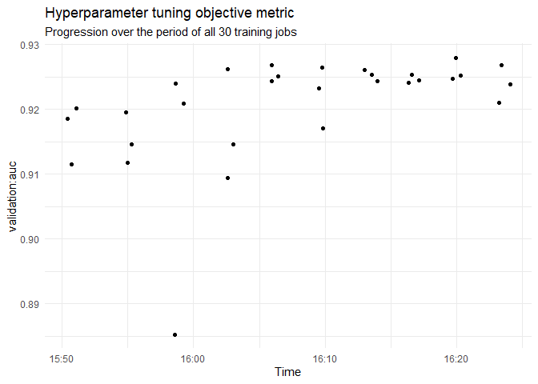
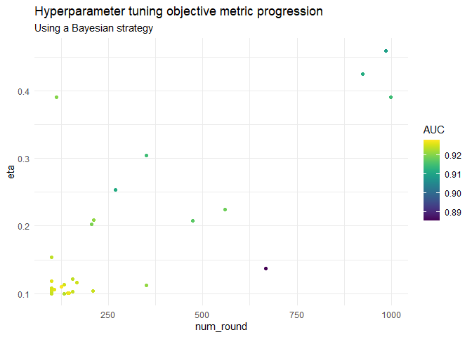
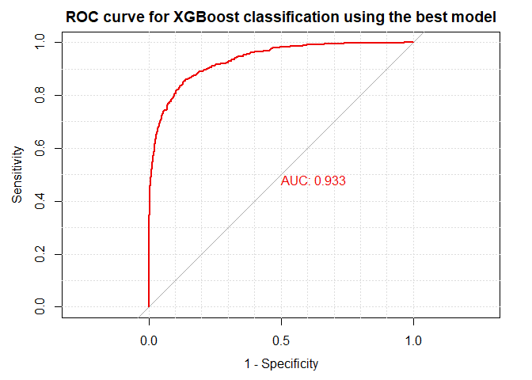

# SageMaker fundamentals for R users <br/>  Part 03: Hyperparameter tuning

In the last module *Part 02: Training a model with a built-in algorithm*
we learned how to configure and start *a single training job with static
hyperparameters* using the built-in XGBoost algorithm to solve a binary
classification problem. Single training jobs in SageMaker cannot include
tunable hyperparameters.

In this module we will continue to use the hotels example project. This
time you will learn how to configure and start *a hyperparameter tuning
job with static and tunable hyperparameters* using the built-in XGBoost
algorithm. Typically, a hyperparameter tuning job executes multiple
training jobs. Along the way we have a closer look at the underlying
mechanisms of SageMaker hyperparameter tuning jobs.

Introduction
------------

We assume that you finished the first module on training a single model
with the built-in XGBoost algorithm and that you you uploaded the
pre-processed training, validation and test datasets to S3 having
followed the defined path and folder structure. We won’t repeat the data
exploration steps here but focus on configuring and starting a
hyperparameter tuning job based on the preprocessed and uploaded data.

Load necessary libraries
------------------------

To use code in this module, you will need to load the following
packages:

``` r
library(reticulate)    # for calling the SageMaker Python SDK from R
library(purrr)         # for parsing the SageMaker responses
library(dplyr)         # for processing the SageMaker responses
library(ggplot2)       # for visualizing the tuning job results
library(viridis)       # provides color palettes that are easy to read by those with colorblindness
library(readr)         # for reading the test set from disk 
library(pROC)          # for the evaluation of the final model performance
library(caret)         # for the evaluation of the final model performance
```

Preparation
-----------

We activate the conda environment we prepared and set up in the first
module *Part 01: Configuring RStudio* to connect to SageMaker from your
RStudio environment.

We import the SageMaker Python module and create a session object which
provides convenient methods for manipulating entities and resources that
Amazon SageMaker uses, such as training jobs, endpoints, and input data
sets in S3.

``` r
use_condaenv("sagemaker-r", required = TRUE)

sagemaker <- import("sagemaker")
session <- sagemaker$Session()
```

Calling `default_bucket()` on the SageMaker session object returns the
name of the default SageMaker bucket we created during the initial setup
in the first article of this series. We choose *hotels* as our project
name and we further specify the S3 *data* and *models* paths we also
used earlier.

``` r
bucket <- session$default_bucket()
project <-  "hotels"
data_path <- paste0(project, "/", "data")
models_path <- paste0("s3://", bucket, "/", project, "/", "models")
```

Next, we retrieve the paths to the datasets we uploaded to S3 in the
previous module. We need this information later when telling SageMaker
where to fetch the data from when starting the hyperparameter tuning job
and the inference job.

``` r
data_s3_location <- session$list_s3_files(bucket, data_path)
data_s3_location

s3_train <- paste0("s3://", bucket, "/", "hotels/data/hotels_training.csv")
s3_validation <- paste0("s3://", bucket, "/", "hotels/data/hotels_validation.csv")
s3_test <- paste0("s3://", bucket, "/", "hotels/data/hotels_test.csv")
```  

Training and tuning the machine model
-------------------------------------

In this section we first examine the underlying mechanisms of SageMaker
hyperparameter tuning jobs before configuring and starting a tuning job
based on the data from the hotels project.

### The SageMaker hyperparameter tuning process

In regards to the underlying infrastructure provisioning, the
hyperparameter tuning process in SageMaker is very similar to the
training process for a single model we covered in the *Part 02: Training
a model with a built-in algorithm* module.

Every hyperparameter tuning job has its own short-lived EC2 training
cluster. The cluster consists of one or more EC2 instances, whose type
and number you specify. The EC2 training cluster is only live for the
number of seconds the models are trained and will come down immediately
after the hyperparameter tuning job is finished.

The three major differences between single training jobs and
hyperparameter tuning jobs are the following:

-   A hyperparameter tuning job is defined by specifying static AND
    tunable hyperparameters.
-   A hyperparameter tuning job will execute MULTIPLE training jobs
    while searching for the optimal values of the tunable
    hyperparameters. The search for the optimal hyperparameters depends
    on the defined tuning method (aka optimization algorithm).
-   Hyperparameter tuning jobs are defined using an Estimator object AND
    a HyperparameterTuner object. The HyperparameterTuner object starts
    the hyperparameter tuning job.

SageMaker supports two tuning methods: Bayesian optimization which is
the default tuning method and random search. Grid search that you might
be familiar with from using the `caret` or the `mlr` package is not
supported by SageMaker. In this article we will use Bayesian
optimization as the tuning method.

The image below shows the different steps of a hyperparameter tuning job
in more detail.


A hyperparameter job is started calling the `fit()` function via the
API. The following parameters which you pass to `fit()` as part of the
job configuration will determine the infrastructure setup of the
short-lived training cluster:

-   `instance_type` and `instance count`: Define the type of the EC2
    instance and the number of EC2 instances used for a single training
    job as part of the hyperparameter tuning process.
-   `max_jobs`: Determines the maximum number of training jobs that will
    be executed.
-   `max_parallel_job`: The number of training jobs that will be
    executed in parallel.

> **Info**
>
> Since each training job requires `instance_count` number of instances,
> the number of instances running concurrently is equal to
> `instance_count` multipled by `max_parallel_job`.

SageMaker executes the following steps automatically once a
hyperparameter job is started calling `fit()`:

1.  The new EC2 training cluster comes online. In the example in the
    image the hyperparameter tuning job configuration defines one
    ml.m5.xlarge instance (`instance_type = "ml.m5.xlarge`,
    `instance_count = 1`) for a SINGLE training job. Because we decide
    to execute three training jobs in parallel per tuning round
    (`max_parallel_jobs = 3`), the short-lived training cluster will be
    started with 3 ml.m5.xlarge EC2 instances.

2.  The Docker container training image from the SageMaker built-in
    algorithm that lives in the Elastic Container Registry (ECR) is
    pulled into EVERY training instance of the training cluster AND the
    training and validation data sets are transferred from the specified
    Amazon S3 bucket to EVERY training instance of the training cluster.

3.  Because we specified to run nine training jobs in total
    (`max_jobs = 9`) with three training jobs executed in parallel
    (`max_parallel = 3`), we will have three training rounds. Every
    round each of our three ml.m5.xlarge EC2 instances will be fed with
    a different hyperparameter setting.

    1.  *Round 1/3*: Three training jobs are executed with each job
        using a different hyperparameter setting. After the three
        training jobs finish, the trained machine learning models are
        stored in a S3 bucket. In addition, the results of the objective
        metric performance (e.g. AUC scores of the validation test sets
        in case of a binary classification problem) are pulled into the
        Bayesian optimizer.
    2.  *Round 2/3*: The Bayesian optimizer starts three new training
        jobs with each job using a new hyperparameter setting. After the
        three training jobs finish, the trained machine learning models
        are stored in a S3 bucket. In addition, the results of the
        objective metric performance are pulled into the Bayesian
        optimizer.
    3.  *Round 3/3*: The Bayesian optimizer starts the final round with
        three new training jobs and each job using a new hyperparameter
        setting. After the three training jobs finish, the trained
        machine learning models are stored in a S3 bucket. The
        short-lived training cluster is shut down.

Having gained a solid understanding of the underlying fundamentals of
SageMaker hyperparameter tuning jobs, we will now configure and start a
tuning job ourselves.

### Step 1 - Create an estimator object

The first of two essential objects for hyperparameter tuning on
SageMaker via the API is an Estimator object.

> **Info**
>
> An Estimator object specifies the core components for single training
> jobs that are part of a hyperparameter tuning job:
>
> 1.  The type and the number of EC2 instance for the training job.
> 2.  The location of the ML algorithm docker container image in the
>     Elastic Container Registry.
> 3.  The static hyperparameters that won’t be tuned during the training
>     job.
> 4.  The learning objective.

*Note*: Unlike for single training jobs, the evaluation metric for the
validation data set won’t be defined in the Estimator object but in the
HyperparameterTuner object later.

We create our own Estimator instance, specifying the following
parameters in the constructor:

-   `image_name`: The location of the SageMaker built-in XGBoost
    algorithm docker container image in the Elastic Container Registry
    (ECR). We will use XGBoost version 1.0-1.
-   `role`: The AWS Identity and Access Management (IAM) role that
    SageMaker can assume to perform tasks on your behalf like, e.g.,
    fetching data from Amazon S3 buckets and writing the trained model
    artifacts back to Amazon S3. This is the role we set up and whose
    Amazon Resource Name (ARN) we stored as a R environment variable in
    the *Part 01: Configuring RStudio* module.
-   `train_instance_count` and `train_instance_type`: The type and
    number of EC2 instances that together represent a training instance
    of our training cluster to execute a SINGLE training job. We use two
    ml.m5.4xlarge instances.
-   `train_volume_size`: The size, in GB, of the Amazon Elastic Block
    Store (Amazon EBS) storage volume to attach to the training
    instance. It is recommended that you have enough total memory in the
    selected EC2 instances to hold the training data.
-   `output_path`: The path to the S3 bucket where Amazon SageMaker
    stores the training results.
-   `sagemaker_session`: The session object that manages interactions
    with Amazon SageMaker APIs and any other AWS service that the
    training job uses.

<!-- -->
``` r
region <- session$boto_region_name

# get container image location
container <- sagemaker$amazon$amazon_estimator$get_image_uri(region, "xgboost",
                                                             repo_version = "1.0-1")

# get SageMaker execution role stored in .Renviron
role_arn <- Sys.getenv("SAGEMAKER_ROLE_ARN")

# Create an Estimator object
xgb_estimator <- sagemaker$estimator$Estimator(
  image_name = container,
  role = role_arn,
  train_instance_count = 1L,
  train_instance_type = "ml.m5.12xlarge",
  train_volume_size = 30L,
  train_max_run = 3600L,
  output_path = models_path,
  sagemaker_session = session
)
```

### Step 2 - Define the static hyperparameters

Next, we set the static hyperparameters of the XGBoost algorithm that
won’t be tuned by calling `set_hyperparameters()` on the Estimator
object:

``` r
xgb_estimator$set_hyperparameters(
  objective = "binary:logistic",
  min_child_weight = 1 
)
```

### Step 3 - Define the tunable hyperparameters

Now, it is time to define the hyperparameters that are tuned during the
execution of the tuning job.

> **Info**
>
> For every tunable hyperparameter you specify the range of values to
> search over. Available hyperparameter range types are categorical
> ranges, integer ranges and continuous ranges.
>
> For integer and continuous hyperparameter ranges you can further
> specify the scaling type to use to search the range of values.

[Available scaling
types](https://docs.aws.amazon.com/sagemaker/latest/dg/automatic-model-tuning-define-ranges.html#scaling-type)
are auto (default), linear, logarithmic, and reverse logarithmic.
Logarithmic scaling only works for ranges that have values greater than
0. When selecting automatic scaling, SageMaker uses log scaling or
reverse logarithmic scaling whenever the appropriate choice is clear
from the hyperparameter ranges.

``` r
hyperparameter_ranges <- list(
  num_round = sagemaker$tuner$IntegerParameter(100L, 1000L),
  max_depth = sagemaker$tuner$IntegerParameter(1L, 10L),
  eta = sagemaker$tuner$ContinuousParameter(00.1, 0.5, "Logarithmic")
)
```

We go with [the default
settings](https://docs.aws.amazon.com/sagemaker/latest/dg/xgboost_hyperparameters.html)
for the remaining hyperparameters.

### Step 4 - Create an HyperparameterTuner object

Next we create a HyperparameterTuner object which is the second of the
two central objects for hyperparameter tuning on SageMaker via the API.

> **Info**
>
> A HyperparameterTuner object specifies the core components of a
> hyperparameter tuning job:
>
> 1.  The objective metric for evaluating training jobs
> 2.  The ranges of the tunable hyperparameters that are searched
> 3.  The tuning method (aka optimization algorithm)
> 4.  The maximum total number of training jobs to start
> 5.  The maximum number of parallel training jobs to start

We create a HyperParameterTuner instance, specifying the following
parameters in the constructor:

-   `estimator`: The estimator object we created that includes the
    training job configuration.
-   `objective_metric_name`: We select `validation:auc`, the area under
    the curve calculated for the validation set, as the metric for
    evaluating the training jobs.
-   `hyperparameter_ranges`: The list of tunable hyperparameter ranges
    we specified in the step before.
-   `strategy`: The tuning method, in this case “Bayesian”.
-   `objective_type`: The type of the objective metric for evaluating
    training jobs which is either “Maximum” or “Minimum”. Since our
    objective metric is `validation:auc` we set the parameter to
    “Maximum”.
-   `max_jobs`: We decide to start 30 training jobs in total.
-   `max_parallel_jobs`: Three training jobs start in parallel in each
    round.

<!-- -->
``` r
tuner <- sagemaker$tuner$HyperparameterTuner(
  estimator = xgb_estimator,
  objective_metric_name = "validation:auc",
  hyperparameter_ranges = hyperparameter_ranges, 
  strategy = "Bayesian",
  objective_type = "Maximize",
  max_jobs = 30L,
  max_parallel_jobs = 3L
)
```

Based on the configuration of the Estimator object and the
HyperparameterTuner object, we will start 30 training jobs in total with
3 training jobs starting in parallel in each tuning round. We will have
10 rounds in total. The training cluster will be launched with three
ml.m5.12xlarge instances with each instance executing 10 training jobs
consecutively.

### Step 5 - Define the S3 location of the data sets and the tuning job name

There are only two things left we need to specify before we can start
the tuning job:

-   The S3 location of the training and validation set defined in a
    single list.
-   The tuning job name which we will set up using the
    `\[PROJECT\_NAME-ALGO\_NAME-TIMESTAMP\]` naming schema.

*Note*: At the time of writing a tuner job name is restricted to 32
letters.

``` r
algo <- "xgb"
timestamp <- format(Sys.time(), "%Y-%m-%d-%H-%M-%S")
job_name <- paste(project, algo, timestamp, sep = "-")


s3_train_input <- sagemaker$s3_input(s3_data = s3_train,
                                     content_type = 'csv')
s3_valid_input <- sagemaker$s3_input(s3_data = s3_validation,
                                     content_type = 'csv')

input_data <- list('train' = s3_train_input,
                   'validation' = s3_valid_input)
```

### Step 6 - Start the tuning job

Calling `fit()` on our HyperparameterTuner object will start the tuning
process shown in [the image in the SageMaker hyperparameter tuning
process section](#the-sagemaker-hyperparameter-tuning-process).
SageMaker fetches the training and the validation set from S3, obtains a
built-in XGBoost algorithm docker container image for ML model training
from ECR and pulls it into the newly launched EC2 training cluster. All
of this happens fully-managed behind the scenes without further
interaction with the user.

``` r
tuner$fit(inputs = input_data, 
          job_name = job_name)
```

We can check via the API when the training job is finished. Once it has
reached the status **Completed** you can move ahead to the next section.

``` r
session$describe_tuning_job(job_name)[["HyperParameterTuningJobStatus"]]

## [1] "Completed"
```

### Step 7 - Evaluate the tuning job results

Once the last round of training jobs finishes, SageMaker automatically
shuts down and terminates our EC2 training cluster. We now check the
tuning results by examining the final AUC value of each of the 30
training jobs first.

``` r
tuning_job_results <- sagemaker$HyperparameterTuningJobAnalytics(job_name)
tuning_results_df <- tuning_job_results$dataframe()
head(tuning_results_df)[, c(1:4, 6)]

##         eta max_depth num_round                             TrainingJobName
## 1 0.1541080        10       100 hotels-xgb-2020-06-30-15-46-50-030-edf917d1
## 2 0.1063944         9       108 hotels-xgb-2020-06-30-15-46-50-029-254d02dc
## 3 0.1117450        10       350 hotels-xgb-2020-06-30-15-46-50-028-e09e96cf
## 4 0.1028238         7       100 hotels-xgb-2020-06-30-15-46-50-027-e49e55a6
## 5 0.1098748         9       126 hotels-xgb-2020-06-30-15-46-50-026-b870ae81
## 6 0.1160199         9       166 hotels-xgb-2020-06-30-15-46-50-025-9c4b6508
##   FinalObjectiveValue
## 1             0.92384
## 2             0.92683
## 3             0.92108
## 4             0.92521
## 5             0.92799
## 6             0.92478
```

We can also plot a time series chart that shows how our objective metric
AUC developed over the course of the 30 training jobs based on the
underlying tuning orchestrated by the Bayesian optimizer. In the chart
you can see that every time three training jobs were started in parallel
.

``` r
# Tuning diagnostics 
ggplot(tuning_results_df, aes(TrainingEndTime, FinalObjectiveValue)) +
  geom_point() +
  xlab("Time") +
  ylab(tuning_job_results$description()$TrainingJobDefinition$StaticHyperParameters$`_tuning_objective_metric`) +
  ggtitle("Hyperparameter tuning objective metric",  
          "Progression over the period of all 30 training jobs") +
  theme_minimal()
```



In the following chart we plot `eta` against `num_round` to show how the
Bayesian optimizer focused most of its training jobs on the region of
the search space that produced the best models. The color of the dots
shows the quality of the corresponding models based on the underlying
AUC scores on the validation set. Yellow dots correspond to models with
better AUC scores and violet dots indicate a worse AUC.

``` r
ggplot(tuning_results_df, aes(num_round, eta)) +
  geom_point(aes(color = FinalObjectiveValue)) +
  scale_color_viridis("AUC", option = "D") +
  ggtitle("Hyperparameter tuning objective metric progression", "Using a Bayesian strategy") +
  theme_minimal()
```



Next, we extract the name of the best training job from the job list and
then call `describe_training_job()` on the session object to get
additional information about the best training job:

``` r
best_tuned_model <- tuning_results_df %>%
  filter(FinalObjectiveValue == max(FinalObjectiveValue)) %>%
  pull(TrainingJobName)
best_tuned_model

## [1] "hotels-xgb-2020-06-30-15-46-50-026-b870ae81"

training_job_stats <- session$describe_training_job(job_name = best_tuned_model)

final_metrics <-  map_df(training_job_stats$FinalMetricDataList, 
                          ~tibble(metric_name = .x[["MetricName"]],
                                  value = .x[["Value"]]))
final_metrics

## # A tibble: 3 x 2
##   metric_name     value
##   <chr>           <dbl>
## 1 validation:auc  0.928
## 2 train:auc       0.992
## 3 ObjectiveMetric 0.928
```

Final model evaluation
----------------------

For the final model evaluation we will use the hold-out test set which
we also created and uploaded to S3 and follow the exact same procedure
we already used for the final evaluation of a single training job
described in the last article.

We will use Batch Transform which is a SageMaker feature for generating
batch inferences. After that we will use built-in R capabilities to
evaluate the results. We won’t explain the details of each step to
configure and start a Batch Transform job here. Please refer to the
*Part 02: Training a model with a built-in algorithm* module for an
in-depth description.

### Step 1 - Create a Transformer object

This time we won’t be able to create the Transformer object by calling
`transformer()` on the Estimator object as shown for single training
jobs in the previous article. Instead we use the Transformer constructor
and specify the model we like to use to generate the predictions
explicitly using the `model_name` parameter.

For this we need to create a SageMaker model first based on the
SageMaker training job by calling `create_model_from_job()` on the session
object. If no model name is specified, the model automatically gets the
name of the training job.

``` r
predictions_path <- paste0(models_path, "/", best_tuned_model, "/predictions")

session$create_model_from_job(best_tuned_model)

xgb_batch_predictor <- sagemaker$transformer$Transformer(
  model_name = best_tuned_model,
  instance_count = 1L, 
  instance_type = "ml.m5.4xlarge", 
  strategy = "MultiRecord",
  assemble_with = "Line",
  output_path = predictions_path
)
```

### Step 2 - Start the batch prediction job

We start our batch prediction job by calling `transform()` on the
Transformer object.

``` r
xgb_batch_predictor$transform(
  data = s3_test, 
  content_type = 'text/csv',
  split_type = "Line",
  job_name = best_tuned_model)
```

We can check via the API when the batch prediction job is finished and
the inference cluster is shut and terminated. Once it has reached the
status **Completed** you can move ahead to the next section.

``` r
session$describe_transform_job(best_tuned_model)[["TransformJobStatus"]]

## [1] "Completed"
```

### Step 3 - Download the test set predictions

Next, we will download the prediction results from S3 and store them as
a CSV file locally before reading them into a vector. Then we read the
test set we stored in the previous article from disk. We store the
predictions with the actual test set outcomes in a new tibble
`test_results`.

``` r
s3_downloader <- sagemaker$s3$S3Downloader()
s3_test_predictions_path <- s3_downloader$list(predictions_path)
 
dir.create("./predictions")

## Warning in dir.create("./predictions"): '.\predictions' already exists

s3_downloader$download(s3_test_predictions_path, "./predictions")
 
test_predictions <- read_csv("./predictions/hotels_test.csv.out",
                              col_names = FALSE) %>% 
   pull(X1)

hotels_test <- read_csv("../data/hotels_test_with_dependent_variable.csv")

test_results <- tibble(
  truth = hotels_test$children,
  predictions = test_predictions
)

head(test_results)

## # A tibble: 6 x 2
##   truth predictions
##   <dbl>       <dbl>
## 1     0     0.00679
## 2     0     0.0151 
## 3     0     0.00475
## 4     0     0.0532 
## 5     0     0.0244 
## 6     0     0.00345
```

### Step 4 - Evaluate the test set predictions

Let us have a look at the ROC curve and the AUC value of the test data
set using the `pROC` package:

``` r
roc_obj <- roc(test_results$truth, test_results$predictions,
               plot = TRUE,         
               grid = TRUE,
               print.auc = TRUE,
               legacy.axes = TRUE, 
               main = "ROC curve for XGBoost classification using the best model",
               show.thres=TRUE,
               col = "red2"
)

## Setting levels: control = 0, case = 1

## Setting direction: controls < cases
```



Creating a confusion matrix using the `caret` package we see the
following results:

``` r
conf_matrix <- confusionMatrix(
  factor(ifelse(test_results$predictions >= 0.5, 1, 0), levels = c("0", "1"), 
         labels = c("no children", "children")),
  factor(test_results$truth, levels = c(0, 1), 
         labels = c("no children", "children")), 
  positive = "children")
conf_matrix

## Confusion Matrix and Statistics
## 
##              Reference
## Prediction    no children children
##   no children        6827      300
##   children             66      307
##                                          
##                Accuracy : 0.9512         
##                  95% CI : (0.9461, 0.956)
##     No Information Rate : 0.9191         
##     P-Value [Acc > NIR] : < 2.2e-16      
##                                          
##                   Kappa : 0.602          
##                                          
##  Mcnemar's Test P-Value : < 2.2e-16      
##                                          
##             Sensitivity : 0.50577        
##             Specificity : 0.99043        
##          Pos Pred Value : 0.82306        
##          Neg Pred Value : 0.95791        
##              Prevalence : 0.08093        
##          Detection Rate : 0.04093        
##    Detection Prevalence : 0.04973        
##       Balanced Accuracy : 0.74810        
##                                          
##        'Positive' Class : children       
## 
```

Even though the accuracy for the test set predictions is quite high, the
model did not perform that well in identifying the “positive” class
(having children). The low sensitivity was expected based on the class
imbalance in the original data set which we fairly ignored while
preprocessing the data at the beginning. However, the tuned model
performed better in every area compared to the model we created based on
the single training job in the previous module.

Summary
-------

In this module we explained the underlying mechanisms of SageMaker
hyperparameter tuning jobs and showcased how to start tuning jobs using
the Estimator object/HyperparameterTuner object combination. We created
some plots visualizing the progress and results of the tuning job.
Finally, we used a Transformer object to start a batch inference job to
make test set predictions using the best model and evaluated the final
model performance in R.

In the next workshop module we will have a have a deep dive on model
deployment for real-time predictions.
