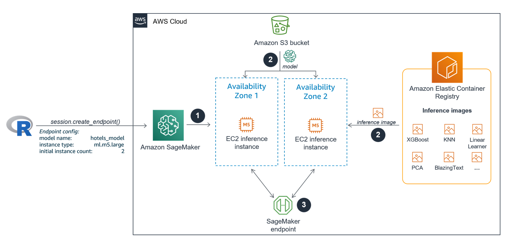

# SageMaker fundamentals for R users <br/> Part 04: Model deployment for real-time predictions

In the last module *Part 03: Hyperparameter tuning* we learned how to configure and start a hyperparameter tuning job using the built-in XGBoost algorithm. We started a tuning job to create 30 different XGBoost models based on the hotels data set. We identified and evaluated the best performing model. 

In this module we will deploy the best performing model as an HTTPS endpoint and make real-time predictions against it. You will learn the different steps of the SageMaker deployment process for *deploying a single model that is based on a built-in algorithm behind an endpoint*. We won't cover more sophisticated deployment options like endpoints with production variants or multi-model endpoints. Endpoints with production variants allow you to put heterogeneous models, which all serve the same purpose and reside in individual inference containers, behind the same endpoint. Multi-model endpoints allow you to deploy various homogeneous models of the same model type to a single SageMaker inference container which is behind a single endpoint.


## The SageMaker deployment process

The SageMaker deployment process is quite similar to a Batch Transform job you already used twice for generating batch inferences for the hold-out test set in the previous two workshop modules. However, unlike Batch Transform jobs, a deployment process won't create a short-lived EC2 inference cluster but an inference cluster that is online until the user deliberately decides to shut it down. 

SageMaker executes the following steps automatically once a deployment job is started using the `create_endpoint()` function via the API:

1. The new long-lived EC2 inference instances come online based on an endpoint configuration that specifies the ML model, the docker container inference image and the inference configuration.
2. The docker container inference image from the SageMaker built-in algorithm that lives in the Elastic Container Registry (ECR) is pulled into EVERY inference instances. In addition, the model which creates the predictions is transferred from the specified Amazon S3 bucket to EVERY inference instance.
3. The model endpoint comes live and is ready to serve real-time prediction requests which it passes to one of the inference instances. 

The image below shows the different steps of the deployment process in more detail. In the example we set `InitialInstanceCount = 2`. AWS recommends to use multiple instances for mission critical endpoints. Instances will automatically be deployed to separate Availability Zones. 




## Preparation

We assume that you finished all previous workshop modules. In particular, we will deploy the tuned model that you created in the previous workshop module and use the test data set, you saved to your local disk in the second workshop module, to make real-time test predictions.


## Load necessary libraries and activate conda environment 

To use code in this module, you will need to load the following packages:


```r
library(reticulate)    # for calling the SageMaker Python SDK from R
library(purrr)         # for parsing the SageMaker responses
library(readr)         # for reading data from disk 
```

We activate the conda environment we prepared and set up in the first module *Part 01: Configuring RStudio* to connect to SageMaker from your RStudio environment. 

We import the SageMaker Python module and create a session object which provides convenient methods not just for training and tuning but also for model deployment.


```r
use_condaenv("sagemaker-r", required = TRUE)

sagemaker <- import("sagemaker")
session <- sagemaker$Session()
```


## Model deployment 

> **Info**
> 
> Model deployment is a 3-step process:
>
> 1) Create a model in SageMaker
> 2) Create an endpoint configuration for an HTTPS endpoint
> 3) Create an HTTPS endpoint

### Step 1 - Create a model

Since we already trained the model, we don't need to do it again here. However, it is important that the model, we like to deploy, is registered with SageMaker. A registered model name is one of the key parameters for defining an endpoint configuration in step 2 below. Luckily, we already registered our desired model in the previous workshop module when we called `create_model_from_job()` on the Session object prior to creating the Transformer object for generating the batch inferences. We only need to fetch the registered model name now. 

Currently, there is not yet a method available in the SageMaker Python SDK for retrieving a list of models that are registered with SageMaker. For this we need use the lower level boto3 client and call `list_models()` on it. Per default, the returned model list is ordered by creation date in descending order. Assuming that the last registered model in your AWS account is the best performing model we trained and registered in the previous module, we go ahead and fetch the top most model name from the list:


```r
boto_client <- session$boto_session$client("sagemaker")
hotels_model <- boto_client$list_models()[["Models"]] %>% 
  map_chr("ModelName") %>% 
  .[[1]]
hotels_model
```

```
## [1] "hotels-xgb-2020-08-11-23-47-46-022-b279ccc9"
```


### Step 2 - Create endpoint configuration

Next, we define and save an endpoint configuration which specifies the ML model we like to use to generate the real-time predictions, the docker container inference image and the inference cluster configuration. We create and save an endpoint configuration in SageMaker by calling `create_endpoint_config()` on the Session object. A created endpoint configuration can be used in various endpoint deployments later. 


```r
config_name <- paste0(hotels_model, "-config3")
session$create_endpoint_config(name = config_name,
                               model_name =  hotels_model, 
                               initial_instance_count = 1L, 
                               instance_type = "ml.m5.large")
```

### Step 3 - Create endpoint

Now, it is time to finally deploy our current model champion to production. We do this by calling `create_endpoint()` on the Session object. The major parameters we need to specify are the name of the new endpoint, an endpoint configuration and whether or not to wait for the endpoint deployment to complete before returning to the console. Since endpoint deployment usually takes several minutes, we recommend to set `wait = FALSE`.


```r
endpoint_name <- "hotels-endpoint"
session$create_endpoint(endpoint_name = endpoint_name, 
                        config_name = config_name,
                        wait = FALSE)
```

We can check via the API when the endpoint is successfully deployed and available. Once it has reached the status **InService** you can move ahead to the next section.


```r
boto_client$describe_endpoint(EndpointName = endpoint_name)[["EndpointStatus"]]
```

```
## [1] "InService"
```

## Make real-time predictions against the endpoint

> **Info**
> 
> SageMaker model endpoints are NOT public web services endpoints. You cannot access 
> an endpoint unless you are already authenticated via the AWS API. 
>
> The endpoint URL does not contain the account ID, but SageMaker determines the account
> ID from the authentication token that is supplied by the caller.

That means that SageMaker endpoints cannot be accessed from the Internet. For instance, if a third-party Shiny application, that uses the `httr` package in the backend to make API calls, likes to make real-time predictions against your endpoint, it cannot access the endpoint directly.

Instead, you need to set up an Amazon API Gateway which serves as an additional security layer that provides an API to clients from the outside. API Gateway can pass the parameter values to the SageMaker endpoint. The model performs the prediction and returns the predicted value back to the API Gateway. API Gateway responds to the client with the predicted value. Setting up an API Gateway is beyond the scope of this workshop. 

Here, we won't need to set up an API Gateway to test validate the endpoint because we are currently already authenticated via the AWS API and are able to access the endpoint directly. 

To do this, we need to instantiate the following objects:

* a Predictor object that makes prediction requests to the inference endpoint.
* A Serializer object to encode data for the inference endpoint. 
* A Deserializer object to decode data from the inference endpoint.

The Amazon SageMaker implementation of XGBoost supports CSV and libsvm formats for (real-time) inference. For inference using CSV data the SageMaker built-in XGBoost algorithm expects that the test set (or any other new data set) comes with no table headers. The CSV data to predict must NOT include the dependent variable. Therefore, we will instantiate a CSV-Serializer and a CSV-Deserializer object below


```r
# Instantiate CSV-Serializer/CSV-Deserializer objects
csv_serializer <- sagemaker$serializers$CSVSerializer()
csv_serializer$CONTENT_TYPE <- "text/csv"
csv_deserializer <- sagemaker$deserializers$CSVDeserializer()

# Instantiate Predictor object
hotels_predictor <- sagemaker$predictor$Predictor(
  endpoint_name = "hotels-endpoint", 
  sagemaker_session = session, 
  serializer = csv_serializer,
  deserializer = csv_deserializer)
```

Now, it is time to make real-time predictions against the hotels endpoint. We will send observations of the test set we saved to disk in the second workshop module *Part 02: Training a model with a built-in algorithm* to the endpoint. When we saved the test set, we made sure to remove the table header and the column of the dependent variable. 

Below we send the first 5 observations all at once to the inference endpoint by calling `predict()` on the Predictor object. SageMaker endpoints support mini-batches for real-time inference requests. 


```r
test_set <- read_csv("../data/hotels_test.csv", col_names = FALSE, n_max = 5) %>% 
  as.matrix()

real_time_predictions <- hotels_predictor$predict(data = test_set) %>% 
  .[[1]] %>% 
  as.numeric()
```


Next, we like to check if the endpoint produced the correct predictions. To do this, we compare the real-time prediction results with the Batch Transform predictions of the test set we calculated and saved in the previous workshop module *Part 03: Hyperparameter tuning*.  


```r
batch_predictions <- read_csv("../03_Model_tuning/predictions/hotels_test.csv.out", 
                              col_names = FALSE, n_max = 5) %>% 
  .[[1]]
  
data.frame(real_time_predictions, batch_predictions)
```

```
##   real_time_predictions batch_predictions
## 1           0.007300874       0.007300874
## 2           0.017646877       0.017646877
## 3           0.004776326       0.004776326
## 4           0.034522254       0.034522254
## 5           0.031237641       0.031237641
```

The prediction results match and we can conclude that the endpoint we deployed works as expected.

Once a real-time inference endpoint reaches the end of its life cycle, you can either delete it via the SageMaker Console or the API which we do next. This also makes sure that the inference instance is not causing any additional costs.


```r
session$delete_endpoint(endpoint_name)
```


## Summary

In this module we explained the underlying mechanisms of the SageMaker model deployment process. You learned how to manage an endpoint life cycle  from configuring, deploying and deleting a model as an HTTPS endpoint using the Session object. Moreover, you used a Predictor object to make real-time predictions against the endpoint.


