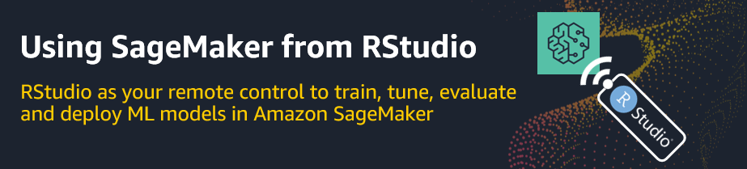

# SageMaker fundamentals for R users 

 

---

The **SageMaker Fundamentals for R users** workshop is for experienced R users with no prior Amazon SageMaker knowledge, who want to use their own (local) RStudio installation as an alternative to SageMaker Notebooks to connect to SageMaker to train, tune, evaluate, deploy and monitor machine learning models in the cloud.

We use a single project example throughout the workshop to explain the entire machine learning process end-to-end using SageMaker from a data science practitioner perspective. In addition, workshop attendees gain a solid understanding of the underlying SageMaker fundamentals, such as what happens behind the scenes when a training, tuning job or batch inference job is started. We show R recipes and best practices on how to parse and visualize the responses returned from Amazon SageMaker in the different stages of the machine learning process. 

 
## Workshop modules

Each workshop module consists of an R Notobook (.Rmd file) so that users can run and experiment with the code examples using their RStudio installation. Workshop attendess should process the workshop modules in the given order. Each subsequent module re-uses pieces from the previous modules. 

1. [Part 01: Configuring RStudio](/01_Configuring_RStudio/01-Configuring_RStudio.Rmd): Explains how to configure your RStudio environment as a “remote control” to connect to SageMaker.

2. [Part 02: Training a model with a built-in algorithm](/02 - Model training/02-Model_training_with_a_built-in_algorithm.Rmd): You start by loading and pre-processing the project example data in RStudio locally before you upload the pre-processed data to S3. Then you launch a single SageMaker training job to train a model using the SageMaker XGBoost built-in algorithm. You use R built-in tools to evaluate the training results and use a SageMaker batch inference job on the test set for the final model evaluation. The module highlights all key objects involved (Estimator, Transformer) and describes how the infrastructure behind the built-in algorithms for training and batch inference jobs works. 

3. [Part 03: Hyperparameter tuning](/03 - Model tuning/03-Model_tuning.Rmd): You learn how to use a hyperparameter tuning job instead of a single training job to train various models. The module highlights the key objects involved in tuning jobs in comparison to single training jobs (Estimator objects for single training jobs vs. Estimator & HyperparameterTuning objects for tuning jobs) and describes how the infrastructure for the tuning process works. We use built-in R tools to evaluate the tuning results and use a batch inference job on the test set for the final model evaluation.

3. Part 04: Model deployment for real-time predictions: Coming soon!

## Prerequisites 

**AWS Cloud**

* It is a plus if workshop attendees have some basic familiarity with the AWS Console.

* Every workshop attendee needs to have access to an AWS account using an IAM user. [AWS Free Tier](https://aws.amazon.com/de/free/) does also work for this workshop. 

* The IAM user needs to come with security credentials (Access key ID, Secret access key) that allows him to make secure requests to AWS service APIs. The first workshop module *Part 1: Configuring RStudio* explains how to store the security credentials as environment variables on the user's machine.

**Local installations**

* [R](https://cran.r-project.org/) and [RStudio Desktop](https://rstudio.com/products/rstudio/download/)

* [Git](https://git-scm.com/downloads)

## Workshop installation & start

* Git clone this repo on your machine: `git clone https://github.com/alex23lemm/AWS-SageMaker-Fundamentals-R-Workshop.git`.

* Click on ``aws-sagemaker-r-fundamentas-workshop.Rproj` and open the project in RStudio.

* Open the first R notebook contained in the `01 - Configuring RStudio` folder and follow along.

* Have fun!

## What's next?

You have mastered the SageMaker fundamentas and like to learn more on how to leverage SageMaker as an R user? Please find below additional resources that will help you on your journey: 

* The [Using R in SageMaker](https://github.com/nickminaie/AWS-SageMaker-R-Workshop) workshop
  * This workshop can be seen as a follow-up to the *SageMaker Fundamentals for R users* workshop.
  * In the majority of its modules you will use SageMaker Notebooks with an R kernel instead of RStudio to explore the data and to start the various SageMaker jobs.
  * Besides other topics, the workshop will teach you how to bring your own R algorithm to SageMaker, how to connect to an Elastic Map Reduce cluster using the sparklyr package to process Spark (ML) jobs or how to create a persistent custom R environment for SageMaker.

* The official SageMaker documentation: [R User Guide to Amazon SageMaker](https://docs.aws.amazon.com/sagemaker/latest/dg/r-guide.html)

## Disclaimer

* The content provided in this repository is for demonstration purposes and not meant for production. You should use your own discretion when using the content.
* The ideas and opinions outlined in these examples are my own and do not represent the opinions of AWS.

